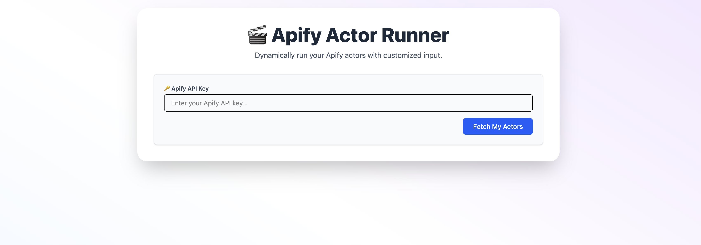
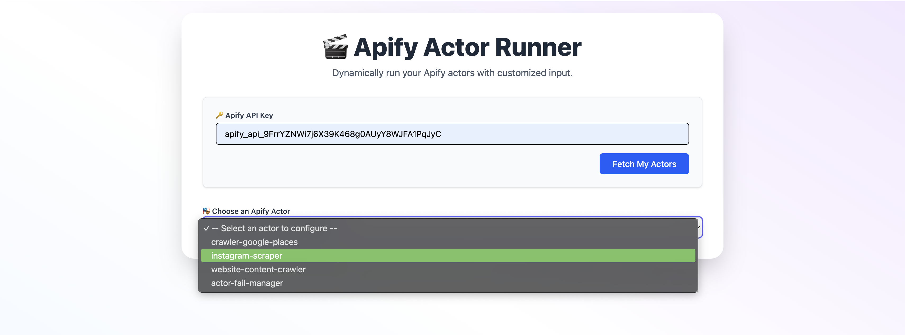
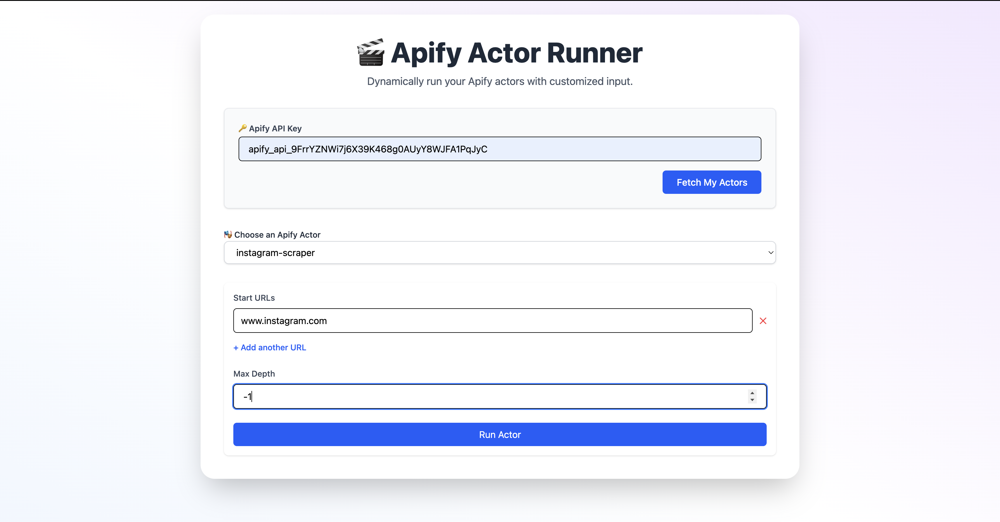
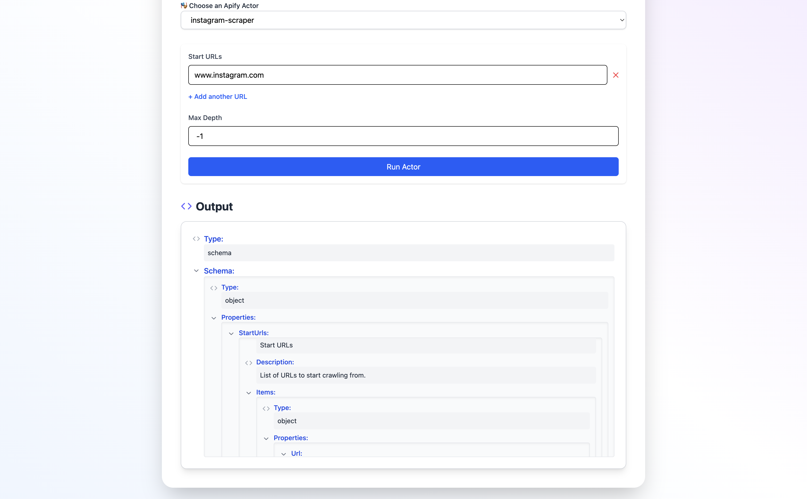

## 🛠️ Installation & Running Locally

### 1. Clone the repository

```bash
git clone https://github.com/your-username/apify.git
cd apify
````

### 2. Install Backend

```bash
cd backend
npm install
npm run start
```
Create a `.env` file inside `backend/` and add:

```
PORT=5001
```

Backend will run on `http://localhost:5001`

### 3. Install Frontend

In a new terminal:

```bash
cd frontend
npm install
```

Create a `.env` file inside `frontend/` and add:

```
VITE_BACKEND_URL=http://localhost:5001
```

Then run:

```bash
npm run dev
```

Frontend will be available at `http://localhost:5173`

---

## 🤖 Actor Used for Testing

We used the **[`instagram-scraper`](https://apify.com/epctex/instagram-scraper)** actor from Apify for testing.

### Why this actor?

* Popular use case
* Accepts structured input
* Provides clear, visual output
* Easy to test in a UI-based flow

---

## 📐 Assumptions & Design Choices

* 🔑 The user must provide their own Apify API key to interact with the API securely.
* 🌐 Frontend and backend are hosted separately (Netlify and Render), so CORS is properly handled on the backend.
* 🧩 Backend handles all interactions with the Apify API to keep secrets safe and reduce frontend complexity.
* ⚙️ Dynamic schema fetching was designed to allow future enhancement where a UI form can be generated based on the selected actor's input schema.
* 🧪 Only public actors were tested for demo purposes.

---

## 🧩 Workflow Overview

### Step 1: Enter Apify API Key

Users enter their personal Apify API key to authorize the application to make requests on their behalf.



---

### Step 2: Select an Actor

Available public actors are fetched and displayed in a dropdown list.



---

### Step 3: Input Actor Parameters

Users fill in the required parameters based on the selected actor. These can include target usernames, limits, or filters.



---

### Step 4: Run the Actor and View Output

Once submitted, the backend runs the actor and returns the run details or output, which is then displayed in the frontend.



---

## 📎 Folder Structure

```
apify/
│
├── backend/               # Express backend
│   ├── src/
│   │   ├── routes/
│   │   │   └── actorRoutes.js
│   │   ├── controllers/
│   │   │   └── actorController.js
│   │   └── app.js
│
├── frontend/              # React frontend
│   ├── src/
│   │   ├── components/
│   │   │   ├── ActorSelector.jsx
│   │   │   ├── InputForm.jsx
│   │   │   └── OutputDisplay.jsx
│   │   ├── App.jsx
│   │   └── main.jsx
│   ├── public/
│   └── index.html
│
├── .gitignore
├── README.md
└── package.json
```

---

## 📬 Feedback

Feel free to open issues or submit PRs. Contributions, suggestions, and feature ideas are always welcome!

---
